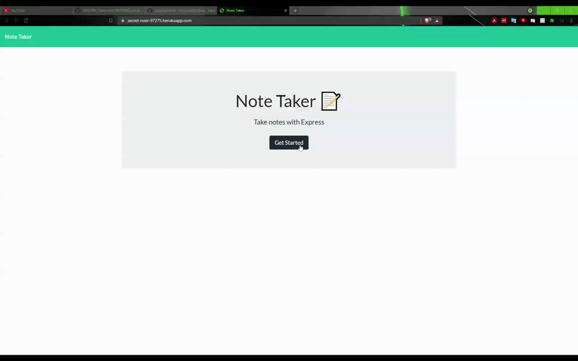

# Note Taker

## Table of Contents
    
- [Description](#description)
- [Installation](#installation)
- [Usage](#usage)
- [Contribution](#contribution)
- [Testing](#testing)
- [Questions](#questions)
    
## Description
    
This application allows the user to take notes and store them through the use of a heroku server.
    
## Authors
    
Ryan McCarthy

## Usage
    
Notes can be stored and deleted on the page listed below

## Demo

## Questions
    
Please reach out to rmmccar92@gmail.com with any questions you may have
  
[Github Profile](https://github.com/rmmccar92)

